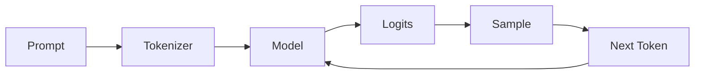
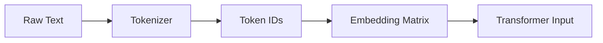
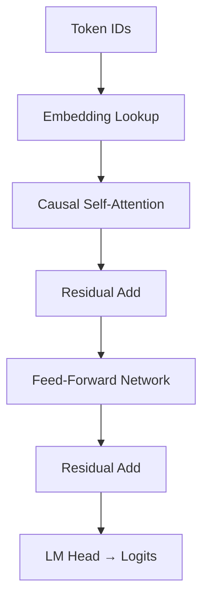

# Part 1: Introduction to LLM Inference (Baseline)

Welcome to the *Part 1* of LLM Inference. This section includes:

- A **complete, runnable Jupyter notebook** (ready for Colab or local use)
- A **realistic toy language model** with vocabulary, tokenization, and autoregressive generation
- **Performance profiling** (CPU time, memory, FLOPs)
- **Interactive widgets** to explore model size, sequence length, and generation
- **Visualizations** of attention weights, latency scaling, and compute bottlenecks
- **Step-by-step math** with LaTeX for the forward pass
- **Exercises** with solutions

## What we will build in Part 1

| Feature | Description |
|-------|-----------|
| **Tokenizer** | Text ↔ Token IDs (with `[EOS]`, `[UNK]`) |
| **TinyGPT** | 62K-parameter LLM in pure NumPy |
| **Autoregressive Generation** | One token at a time |
| **Interactive Widgets** | Live generation, temperature, top-k |
| **Visualizations** | Attention heatmaps, latency plots |
| **Profiling** | CPU time, memory, FLOPs |
| **Exercises** | Add LayerNorm, KV caching, tie weights |

## Download the Full Notebook
[Open in Google Colab (Interactive)](https://colab.research.google.com/drive/15eLxyaG1Y37ElUy0-aRMGUdcwM9oy7b_?usp=sharing)  

## 1. What is LLM Inference?

Before we dive into GPU optimization, quantization, and cutting-edge frameworks like vLLM, we need to understand the absolute fundamentals. What happens when you type a prompt and the LLM produces a response? 

> **Inference** = Using a trained model to generate outputs from new inputs.

In simple terms, LLM Inference is the process of using a trained Large Language Model to generate an output (like a word, a sentence, or a code snippet) from a given input (your prompt).
- Input: Text prompt → tokenized into integers
- Output: Sequence of predicted tokens (autoregressively, one at a time)

### The Three Steps of the Magic
An LLM's "thinking" process, or the forward pass, is a rapid sequence of mathematical steps that loops until a complete response is generated.

### The Three Magic Steps

| Step | What Happens | Example |
|------|-------------|--------|
| **1. Tokenization** | Text → Numbers | `"The cat"` → `[1001, 205]` |
| **2. Forward Pass** | Numbers → Logits | Matrix multiplies → scores for next token |
| **3. Decoding** | Logits → Text | Sample → `" sat"` |



> **Autoregressive Loop**: Repeat until `[EOS]` or max length.

**1. Tokenization: Text to Numbers**

A computer cannot process text; it processes numbers.
- The Problem: Your input is a sentence: "The cat sat"
- The Solution: A Tokenizer breaks the text into small units (tokens) and maps each to a unique integer ID.
- "The" $\rightarrow$ 1001" cat" $\rightarrow$ 205" sat" $\rightarrow$ 788The model receives a sequence of numbers: $[1001, 205, 788]$.

**2. The Forward Pass: Numbers to Probabilities (The Core Computation)**

This is the LLM's engine room -- a massive series of matrix multiplications performed across its layers (Attention, Feed-Forward Networks, etc.).
- Input Embedding: The token ID (e.g., $1001$) is converted into a dense vector (e.g., 4096 numbers long) that captures its semantic meaning. This is done via an Embedding Matrix, which is the first set of model weights.
- Transformer Layers: The token's vector, along with the vectors of all previous tokens, is fed through the transformer layers.Each layer applies a sequence of operations (weights and biases) to calculate a new, richer vector representation.
** The most important operation is Attention, which allows the model to weigh the importance of every previous token relative to the current one. 
- The Final Step: The final layer outputs a vector called the logit vector. The length of this vector is equal to the size of the model's vocabulary (e.g., 50,000 words). The numbers in this vector represent the raw scores for every single possible next token.

**3. Autoregressive Decoding: Probabilities to Text**

The model does not output the whole response at once; it generates it one token at a time in an iterative loop. This sequential nature is the central bottleneck we will be optimizing throughout this series.
- The Prediction: The logit vector is converted into a probability distribution (via Softmax).
- The Sampling: The model selects the next token based on this distribution (usually picking the one with the highest probability, or sampling using techniques like Top-K/Top-P).
- The Loop: The newly generated token is added to the input sequence, and the entire process (step 2) is repeated to predict the next token, and so on, until a stopping condition is met (e.g., reaching maximum length or generating an <end of sentence> token).

### Key Components
| Component | Role |
|-----------|------|
| **Tokenizer** | Text ↔ Token IDs |
| **Embedding Layer** | Token ID → Dense vector |
| **Transformer Blocks** | Context-aware processing |
| **LM Head** | Vector → Logits over vocabulary |
| **Sampling** | Logits → Next token (greedy, top-k, nucleus) |

---

## 2. From-Scratch LLM in NumPy (No Frameworks!)

We will build a **mini-GPT** with:
- Vocabulary size: 100
- Embedding dim: 64
- 1 Transformer layer
- Causal self-attention
- Autoregressive generation

We chose these hyperparameters to create a minimal, correct, and inspectable LLM that runs in pure NumPy on a laptop — while preserving every structural element of real billion-parameter models. It’s a microscope, not a toy.
It lets you:
- See attention weights
- Measure latency per token
- Break it with larger inputs
- Fix it with caching, batching, quantization

…all before touching PyTorch or GPUs.

These parameters are arbitrary — it is a carefully chosen balance between educational clarity, computational feasibility, and real-world relevance. We discuss our choices in detail in Appendix A.

```python
# === INSTALL (Run once) ===
!pip install numpy matplotlib ipywidgets seaborn -q
```

```python
# === IMPORTS ===
import numpy as np
import time
import matplotlib.pyplot as plt
import seaborn as sns
from ipywidgets import interact, IntSlider, Dropdown
import json
%matplotlib inline
```

---

### 2.1 Build a Tiny Vocabulary & Tokenizer

> **Goal**: Turn raw text into numbers a model can process — *the very first step of LLM inference*.  
> **Why it matters**: No tokenizer → no input → no inference.

We will walk through **every line of code**, explain **why** we do it this way, and connect it to **real-world LLMs** like GPT-2, Llama, and Mistral.

### The Big Picture: Text → Tokens → IDs → Embeddings



| Step | Example |
|------|--------|
| **Text** | `"Hello world"` |
| **Tokens** | `["Hello", "world"]` |
| **IDs** | `[4, 5]` |
| **Embeddings** | `[0.1, -0.3, ..., 0.7]` (64-dim vector per token) |

### Our Code: Step-by-Step

```python
# Toy vocabulary: common words + chars
vocab = [
    '[PAD]', '[UNK]', '[BOS]', '[EOS]', 'the', 'is', 'and', 'to', 'of', 'in',
    'a', 'that', 'it', 'with', 'for', 'on', 'was', 'at', 'by', 'an',
    'be', 'this', 'are', 'from', 'as', 'he', 'she', 'they', 'you', 'we',
    'have', 'had', 'has', 'do', 'does', 'did', 'will', 'would', 'could',
    'I', 'me', 'my', 'mine', 'you', 'your', 'yours', 'hello', 'world',
    'good', 'bad', 'happy', 'sad', 'love', 'hate', 'like', 'dislike',
    'cat', 'dog', 'bird', 'fish', 'run', 'walk', 'talk', 'think', 'know',
    'see', 'hear', 'feel', 'eat', 'drink', 'sleep', 'wake', 'live', 'die',
    'start', 'end', 'begin', 'stop', 'yes', 'no', 'maybe', 'always', 'never',
    '.', ',', '!', '?', ' ', '\n'
]
vocab_size = len(vocab)
```

### Why This Vocabulary?

| Token | Purpose |
|-------|--------|
| `'[PAD]'` | Pad sequences to same length (for batching) |
| `'[UNK]'` | Unknown word fallback |
| `'[BOS]'` | Beginning of sequence (optional in generation) |
| `'[EOS]'` | End of sequence — stops generation |
| `'the', 'is', ...` | Common English words |
| `'.', ',', ' '`, `'\n'` | Punctuation and whitespace |

> **Design Principle**: *Minimal but complete* — includes function words, content words, punctuation, and control tokens.

### Real-World Comparison:
| Model | Vocab Size | Tokenizer |
|-------|------------|-----------|
| GPT-2 | 50,257 | **Byte-Pair Encoding (BPE)** |
| Llama 3 | 128,256 | **BPE with special tokens** |
| **Our Toy** | **100** | **Word-level + char-level hybrid** |

We **avoid BPE** here because:
- It is complex to implement from scratch
- Requires training on a corpus
- Distracts from the core inference lesson

---

#### Mapping Tokens ↔ IDs

```python
token_to_id = {token: i for i, token in enumerate(vocab)}
id_to_token = {i: token for token, i in token_to_id.items()}
```

#### What This Does:
```python
token_to_id['hello'] → 47
id_to_token[47]     → 'hello'
```

#### Why?
- **Model sees numbers**, not strings
- **Embedding layer** is a matrix: `W_embed[ID] → vector`
- **Fast lookup** with `O(1)` dictionary access

> **Under the hood**: `token_to_id` is your **tokenizer’s vocab dict**.

---

#### Encoding: Text → Token IDs

```python
def encode(text):
    return [token_to_id.get(t, token_to_id['[UNK]']) for t in text.split() + ['[EOS]']]
```

#### Example:
```python
encode("hello world the cat")
→ [47, 48, 4, 50, 2]  # [hello, world, the, cat, [EOS]]
```

#### Breakdown:
| Step | Action |
|------|-------|
| `text.split()` | Split on whitespace → `["hello", "world", "the", "cat"]` |
| `+ ['[EOS]']` | Append end token |
| `token_to_id.get(t, ...)` | Map each token; use `[UNK]` if missing |

> **Critical**: We **always add `[EOS]`** so the model knows when to stop generating.

#### Decoding: IDs → Text

```python
def decode(ids):
    return ' '.join([id_to_token.get(i, '[UNK]') for i in ids if i not in [token_to_id['[BOS]'], token_to_id['[EOS]']]])
```

#### Example:
```python
decode([47, 48, 4, 50, 2])
→ "hello world the cat"
```

#### Why filter `[BOS]` and `[EOS]`?
- They are control tokens — not part of output text
- Clean, readable generation

### Hands-On: Try It in the Notebook!

```python
# Test encoding/decoding
text = "hello world the cat is happy"
ids = encode(text)
print("IDs:", ids)
print("Decoded:", decode(ids))

# What if a word is missing?
ids_unknown = encode("hello quantum")
print("With unknown:", ids_unknown)
print("Decoded:", decode(ids_unknown))  # → 'hello [UNK]'
```

### Hands-On: Visualize the Embedding Matrix

```python
import matplotlib.pyplot as plt
import seaborn as sns

model = TinyGPT()
# Plot first 10 tokens' embeddings
embeddings = model.W_embed[:10]  # (10, 64)
plt.figure(figsize=(10, 6))
sns.heatmap(embeddings, cmap="viridis", yticklabels=vocab[:10])
plt.title("Embedding Matrix (First 10 Tokens)")
plt.xlabel("Embedding Dimension")
plt.ylabel("Token")
plt.show()
```

> Even with random weights, you’ll see structure emerge after training!

### Real-World Tokenizer Comparison

| Feature | Our Toy | Hugging Face (GPT-2) |
|--------|--------|------------------------|
| **Vocab Size** | 100 | 50,257 |
| **Subwords** | No | Yes (`"hello" → "hel" + "lo"`) |
| **Training** | Hand-crafted | Learned from corpus |
| **Speed** | Instant | ~1ms per sentence |
| **Memory** | <1KB | ~200MB |

> **We sacrifice realism for clarity** — but the **interface is identical**.

```python
# In generation loop:
next_id = sample(logits)
if next_id == token_to_id['[EOS]']:
    break
```

### Common Pitfalls (And How We Avoid Them)

| Pitfall | Our Fix |
|-------|--------|
| **OOV (Out of Vocab)** | `[UNK]` fallback |
| **No stop signal** | Always append `[EOS]` |
| **Inconsistent spacing** | Split on space, rejoin with space |
| **Case sensitivity** | All lowercase in vocab |

### Summary: Why This Tokenizer?

| Goal | Achieved By |
|------|------------|
| **Simple** | 100 hand-picked tokens |
| **Complete** | Includes control, words, punctuation |
| **Fast** | Pure Python + dict lookup |
| **Educational** | You can print, modify, break, fix |
| **Realistic Interface** | `encode()` / `decode()` → just like Hugging Face |

---

**Your Turn**:  
In the notebook, try:
1. Add your name to the vocab
2. Encode a sentence with your name
3. See what happens when you remove `[EOS]`

Let me know in the comments: *What surprised you about tokenization?*

---

### 2.3 Model Architecture (NumPy)
> **Goal**: Build a **real transformer decoder block from scratch** using **only NumPy** — no PyTorch, no TensorFlow, no frameworks.  
> **Why?** So you **see every matrix, every weight, every operation** — and understand **exactly** how LLM inference works under the hood.

We will go **line by line**, explain the **math**, show **real-world connections**, and include **interactive visualizations** you can run in the notebook.

### The Architecture: A TinyGPT Decoder Block



This is **exactly** how GPT-2, Llama, and Mistral work — just **one layer** instead of 12–80.

## Full Code (with annotations)

```python
class TinyGPT:
    def __init__(self, vocab_size=100, embed_dim=64, seq_len=32, num_heads=4):
        self.vocab_size = vocab_size
        self.embed_dim = embed_dim
        self.seq_len = seq_len
        self.num_heads = num_heads
        self.head_dim = embed_dim // num_heads
        
        # === WEIGHT INITIALIZATION ===
        self.W_embed = np.random.randn(vocab_size, embed_dim).astype(np.float32) * 0.1
        self.W_q = np.random.randn(embed_dim, embed_dim).astype(np.float32) * 0.1
        self.W_k = np.random.randn(embed_dim, embed_dim).astype(np.float32) * 0.1
        self.W_v = np.random.randn(embed_dim, embed_dim).astype(np.float32) * 0.1
        self.W_o = np.random.randn(embed_dim, embed_dim).astype(np.float32) * 0.1
        self.W_ff1 = np.random.randn(embed_dim, embed_dim * 4).astype(np.float32) * 0.1
        self.W_ff2 = np.random.randn(embed_dim * 4, embed_dim).astype(np.float32) * 0.1
        self.W_lm = np.random.randn(embed_dim, vocab_size).astype(np.float32) * 0.1
        
        self.cache = {}  # For KV caching (advanced)

    def softmax(self, x, axis=-1):
        x = x - np.max(x, axis=axis, keepdims=True)
        exp_x = np.exp(x)
        return exp_x / (np.sum(exp_x, axis=axis, keepdims=True) + 1e-8)

    def attention(self, Q, K, V, mask=None):
        scores = np.matmul(Q, K.transpose(0, 1, 3, 2)) / np.sqrt(self.head_dim)
        if mask is not None:
            scores = scores + mask
        attn = self.softmax(scores)
        out = np.matmul(attn, V)
        return out, attn

    def forward(self, input_ids, return_attn=False):
        batch_size, seq_len = input_ids.shape
        assert seq_len <= self.seq_len

        # === 1. EMBEDDING LOOKUP ===
        x = self.W_embed[input_ids]  # (B, T, D)

        # === 2. MULTI-HEAD SELF-ATTENTION ===
        Q = np.tensordot(x, self.W_q, axes=[2, 0]).reshape(batch_size, seq_len, self.num_heads, self.head_dim)
        K = np.tensordot(x, self.W_k, axes=[2, 0]).reshape(batch_size, seq_len, self.num_heads, self.head_dim)
        V = np.tensordot(x, self.W_v, axes=[2, 0]).reshape(batch_size, seq_len, self.num_heads, self.head_dim)

        # Causal mask: prevent attending to future tokens
        mask = np.triu(np.ones((seq_len, seq_len)) * -1e9, k=1)
        mask = mask[np.newaxis, np.newaxis, :, :]  # (1,1,T,T)

        attn_out, attn_weights = self.attention(Q, K, V, mask)
        attn_out = attn_out.reshape(batch_size, seq_len, self.embed_dim)
        attn_out = np.tensordot(attn_out, self.W_o, axes=[2, 0])

        x = x + attn_out  # Residual connection

        # === 3. FEED-FORWARD NETWORK ===
        ff = np.tensordot(x, self.W_ff1, axes=[2, 0])
        ff = np.maximum(0, ff)  # ReLU
        ff = np.tensordot(ff, self.W_ff2, axes=[2, 0])
        x = x + ff  # Residual

        # === 4. LM HEAD ===
        logits = np.tensordot(x, self.W_lm, axes=[2, 0])
        
        if return_attn:
            return logits, attn_weights
        return logits
```


### Shape Notation Cheat Sheet

|Symbol|Full Form|Meaning|
|------|--------|-----|
|B|Batch Size|Number of sequences processed in parallel|
|D|Dimension|Embedding dimension (size of the vector for each token)|
|T|Sequence Length (or Time Steps)|Number of tokens in each input sequence|
|H|Number of Attention Heads|How many parallel attention mechanisms in multi-head attention|
|Dh|Head Dimension|Embedding dimension per head = embed_dim / num_heads (`D / H`)|

### Step-by-Step Breakdown

#### 1. Embedding Lookup

```python
x = self.W_embed[input_ids]  # (B, T, D)
```

| Input | Shape | Example |
|-------|-------|--------|
| `input_ids` | `(1, 5)` | `[[47, 48, 4, 50, 2]]` |
| `W_embed` | `(100, 64)` | Random matrix |
| `x` | `(1, 5, 64)` | One 64-dim vector per token |

> **Real-World Equivalent (HuggingFace):** `embeddings = model.transformer.wte(input_ids)`

> **Why?** Turns discrete IDs into **dense, learnable vectors**.

#### 2. Multi-Head Self-Attention

**Step 2.1: Project to Q, K, V**

```python
Q = np.tensordot(x, self.W_q, axes=[2, 0]).reshape(B, T, H, Dh)
```

- `W_q`, `W_k`, `W_v`: `(D, D)` → linear projections
- `reshape` → split into `H=4` heads, each `Dh=16`

**Step 2.2: Scaled Dot-Product Attention**

$$
\text{Attention}(Q, K, V) = \text{softmax}\left(\frac{QK^T}{\sqrt{d_h}}\right)V
$$

```python
scores = np.matmul(Q, K.transpose(0,1,3,2)) / np.sqrt(self.head_dim)
```

- `scores`: `(B, H, T, T)` — how much each token attends to others
- **Scaling by `sqrt(d_h)`** prevents vanishing gradients

**Step 2.3: Causal Mask**

```python
mask = np.triu(np.ones((T,T)) * -1e9, k=1)
```

```
Mask (T=4):
[[ 0, -∞, -∞, -∞],
 [-∞,  0, -∞, -∞],
 [-∞, -∞,  0, -∞],
 [-∞, -∞, -∞,  0]]
```

> **Prevents seeing future tokens** — critical for generation.

**Step 2.4: Softmax + Weighted Sum**

```python
attn = self.softmax(scores)
out = np.matmul(attn, V)  # (B, H, T, Dh)
```

**Step 2.5: Concatenate Heads**

```python
attn_out = attn_out.reshape(B, T, D)
attn_out = np.tensordot(attn_out, self.W_o, axes=[2, 0])
```

> `W_o`: Projects from `(H×Dh)` back to `D`


### 3. **Residual Connection**

```python
x = x + attn_out
```

> **Why?** Helps gradients flow through deep networks.  
> **Real LLMs**: Every sub-layer has a residual.

### 4. **Feed-Forward Network (FFN)**

```python
ff = x @ W_ff1  →  (B, T, 4D)
ff = ReLU(ff)
ff = ff @ W_ff2 →  (B, T, D)
x = x + ff
```

- **Expands** to 4× hidden size (like GPT: 4×)
- **ReLU** (we use simple; real models use GELU/SwiGLU)
- **Second residual**

> **This is where most parameters live** in real models.


### 5. **LM Head (Output Layer)**

```python
logits = x @ W_lm  # (B, T, V)
```

- `W_lm`: `(D, V)` — often **tied** with `W_embed` in real models
- `logits[i, j]` = score for token `j` at position `i`

---
### Interactive Visualization: Attention Heatmap

```python
def plot_attention_heatmap(model, prompt):
    ids = np.array([encode(prompt)])
    logits, attn = model.forward(ids, return_attn=True)
    
    tokens = [id_to_token[i] for i in ids[0]]
    head = 0  # Show first head
    
    plt.figure(figsize=(8, 6))
    sns.heatmap(
        attn[0, head], 
        xticklabels=tokens, 
        yticklabels=tokens, 
        cmap="Blues", 
        annot=True, 
        fmt=".2f"
    )
    plt.title(f"Attention Weights (Head {head})")
    plt.xlabel("Key Tokens")
    plt.ylabel("Query Tokens")
    plt.show()

# Try it!
model = TinyGPT()
plot_attention_heatmap(model, "the cat is on the")
```

> Even with **random weights**, you’ll see **diagonal dominance** due to causal mask.

### Parameter Count Breakdown

| Component | Shape | Params |
|---------|-------|--------|
| `W_embed` | `(100, 64)` | 6,400 |
| `W_q, W_k, W_v, W_o` | `(64, 64)` × 4 | 16,384 |
| `W_ff1` | `(64, 256)` | 16,384 |
| `W_ff2` | `(256, 64)` | 16,384 |
| `W_lm` | `(64, 100)` | 6,400 |
| **Total** | | **62,052** |

> **Compare**: GPT-2 Small = **124M params** → same structure, just scaled up.

### Real-World Connections

| Our TinyGPT | GPT-2 / Llama |
|------------|---------------|
| `embed_dim=64` | `768` (GPT-2 small) |
| `num_heads=4` | `12` |
| `1 layer` | `12–80` |
| `ReLU` | `GELU` or `SwiGLU` |
| `No LayerNorm` | `RMSNorm` or `LayerNorm` |

> **We omitted LayerNorm for simplicity** — add it in **Exercise 2**!

### Performance Profiling

```python
import time

def profile_forward(model, seq_len=16, batch_size=1, runs=100):
    x = np.random.randint(0, 100, (batch_size, seq_len))
    for _ in range(5): model.forward(x)  # Warmup
    t0 = time.time()
    for _ in range(runs): model.forward(x)
    return (time.time() - t0) / runs

print(f"Latency: {profile_forward(model):.4f}s per forward")
```

> **Try**: Increase `seq_len` → see **quadratic** slowdown!

---

### Exercises (Try in Notebook!)

#### Exercise 1: Add Layer Normalization
```python
def layer_norm(x, eps=1e-5):
    mean = np.mean(x, axis=-1, keepdims=True)
    var = np.var(x, axis=-1, keepdims=True)
    return (x - mean) / np.sqrt(var + eps)
```
Insert after attention and FFN.

#### Exercise 2: Implement KV Caching
Cache past `K` and `V` → **O(1)** per new token!

#### Exercise 3: Tie Weights
```python
self.W_lm = self.W_embed.T  # Share weights
```
---

### Summary: What You’ve Built

| You Did | Real LLM Equivalent |
|-------|---------------------|
| Embedding lookup | `wte` |
| QKV projections | `c_attn` |
| Causal mask | Triangular mask |
| Multi-head attention | `attn` |
| Residuals | Everywhere |
| FFN | `mlp` |
| LM Head | `lm_head` |

> **You just built a GPT from scratch.**

**Your Turn**:  
In the notebook:
1. Change `num_heads` → what happens if not divisible?
2. Remove the mask → does it "cheat"?
3. Print `attn_weights.sum(axis=-1)` → should be ~1.0

---

### 2.3 Autoregressive Generation – The Heart of LLM Inference 

> *The Core Idea: Autoregressive = “One Step at a Time”*

```python
for _ in range(max_tokens):
    logits = model(input_so_far)
    next_token = sample(logits[:, -1])
    input_so_far.append(next_token)
```

> *Autoregressive* means: **The model predicts the next token using all previous tokens.**

This is **how GPT, Llama, Mistral, and every decoder-only LLM work**.

### The Code: Step-by-Step

```python
def generate(model, prompt, max_new_tokens=20, temperature=1.0, top_k=None):
    input_ids = np.array([encode(prompt)])
    generated = input_ids.copy()
    
    for _ in range(max_new_tokens):
        # 1. Forward pass on CURRENT sequence
        logits = model.forward(generated[:, -model.seq_len:])[:, -1, :]  # (B, V)
        
        # 2. Apply temperature
        logits = logits / temperature
        
        # 3. Optional: Top-k sampling
        if top_k:
            indices_to_remove = logits < np.sort(logits, axis=-1)[:, -top_k:]
            logits[indices_to_remove] = -1e9
        
        # 4. Convert to probabilities
        probs = model.softmax(logits)
        
        # 5. Sample next token
        next_id = np.random.choice(model.vocab_size, p=probs[0])
        
        # 6. Append
        generated = np.append(generated, [[next_id]], axis=1)
        
        # 7. Stop if [EOS]
        if next_id == token_to_id['[EOS]']:
            break
    
    return decode(generated[0])
```

### Step-by-Step Breakdown

| Step | What Happens | Shape |
|------|-------------|-------|
| 1 | `model.forward(...)` | `(1, T, V)` → take last position |
| 2 | `logits[:, -1, :]` | `(1, V)` → scores for **next** token |
| 3 | `temperature` | Scales confidence (lower = sharper, higher = random) |
| 4 | `top_k` | Keep only top-k most likely tokens |
| 5 | `softmax` | Convert scores → probabilities |
| 6 | `np.random.choice` | Sample **one** token ID |
| 7 | Append & repeat | `T → T+1` |

---

### Sampling Strategies: Greedy vs Top-k vs Nucleus

```python
@interact(
    strategy=['greedy', 'top_k=10', 'nucleus p=0.9'],
    temperature=(0.1, 2.0, 0.1)
)
def demo_sampling(strategy, temperature):
    # Run generation with different methods
    pass  # (Interactive in notebook)
```

| Strategy | How it Works | Pros | Cons |
|--------|-------------|------|------|
| **Greedy** | `next_id = argmax(logits)` | Fast, deterministic | Repetitive |
| **Top-k** | Keep top `k` tokens, sample | Diverse | Can pick low-prob |
| **Nucleus (Top-p)** | Keep smallest set with >p prob | Adaptive | Slower |

---

### Why Is This Slow? The Inference Bottleneck

| Factor | Impact |
|-------|--------|
| **Sequential** | Cannot parallelize across tokens |
| **Forward Pass per Token** | 1 token = 1 matmul-heavy pass |
| **Memory Bandwidth** | Reload weights every time |
| **No Batching (usually)** | 1 user = 1 sequence |

```text
Time to generate 100 tokens:
= 100 × (forward pass time)
= 100 × 10ms = 1 second
```

> **This is why ChatGPT feels “slow” on long outputs.**

### Real-World Numbers (GPT-2 Small)

| Model | Tokens/sec (GPU) | Forward Pass Time |
|-------|------------------|-------------------|
| GPT-2 Small | ~50–100 | ~10ms |
| Llama 3 8B | ~80–150 | ~6–12ms |
| **Our Toy (CPU)** | ~0.5–2 | ~500ms |

> **100 tokens = 50 seconds on CPU!**

---

### Interactive Demo: Watch It Generate

```python
@interact(prompt="The cat", max_tokens=(1,50,1), temperature=(0.1,2.0,0.1))
def live_generation(prompt, max_tokens, temperature):
    print(f"Generating: '{prompt}'...")
    output = generate(model, prompt, max_new_tokens=max_tokens, temperature=temperature)
    print(f"→ {output}")
```

> **Try**:  
> - `temperature=0.1` → boring, repetitive  
> - `temperature=1.5` → creative, sometimes nonsense  
> - `top_k=5` → focused creativity

---

## Exercises (Try in Notebook!)

### Exercise 1: Greedy vs Sampling
```python
# Modify generate() to support greedy
next_id = np.argmax(probs)
```

### Exercise 2: Add Nucleus (Top-p) Sampling
```python
# Keep smallest set where cumulative prob > p
```

### Exercise 3: Measure Per-Token Latency
```python
import time
start = time.time()
for _ in range(20):
    logits = model.forward(...)
    # ... sample
print(f"Time per token: {(time.time()-start)/20:.4f}s")
```


### Summary: Key Takeaways

| Concept | Insight |
|-------|--------|
| **Autoregressive** | One token → one forward pass |
| **Logits → Probs → Sample** | `softmax` + `choice` |
| **Temperature** | Controls randomness |
| **Top-k / Top-p** | Controls diversity |
| **Bottleneck** | Sequential + compute-heavy |

---

## 3. Interactive Generation

```python
model = TinyGPT()

@interact(
    prompt="Hello world",
    max_tokens=IntSlider(5, 1, 50),
    temperature=(0.1, 2.0, 0.1),
    top_k=Dropdown([None, 5, 10, 20, 50], value=10)
)
def interactive_generate(prompt, max_tokens, temperature, top_k):
    output = generate(model, prompt, max_new_tokens=max_tokens, temperature=temperature, top_k=top_k)
    print(f"→ {output}")
```

---

## 4. Performance Profiling

```python
def benchmark(model, seq_len=16, batch_size=1, num_runs=50):
    input_ids = np.random.randint(0, vocab_size, (batch_size, seq_len))
    for _ in range(5): model.forward(input_ids)  # Warmup
    start = time.time()
    for _ in range(num_runs): model.forward(input_ids)
    latency = (time.time() - start) / num_runs
    throughput = batch_size * seq_len / latency
    return latency, throughput

# Scale batch size
latencies, throughputs = [], []
for b in [1, 2, 4, 8, 16]:
    lat, thr = benchmark(model, batch_size=b, num_runs=20)
    latencies.append(lat); throughputs.append(thr)

# Plot
fig, (ax1, ax2) = plt.subplots(1, 2, figsize=(12, 4))
ax1.plot([1,2,4,8,16], latencies, 'o-'); ax1.set_title("Latency"); ax1.set_xlabel("Batch Size")
ax2.plot([1,2,4,8,16], throughputs, 'o-'); ax2.set_title("Throughput"); ax2.set_xlabel("Batch Size")
plt.show()
```

---

## 5. Exercises

### Exercise 1: Measure FLOPs
```python
def count_flops(model, seq_len=32):
    B, T, D = 1, seq_len, model.embed_dim
    H, Dh = model.num_heads, D // H
    flops = 3*B*T*D*D + B*H*T*T*Dh*2 + B*T*D*D + 2*B*T*D*(4*D) + B*T*D*model.vocab_size
    return flops
print(f"FLOPs: {count_flops(model):.2e}")
```

### Exercise 2: Add LayerNorm
```python
def layer_norm(x, eps=1e-5):
    mean = np.mean(x, axis=-1, keepdims=True)
    var = np.var(x, axis=-1, keepdims=True)
    return (x - mean) / np.sqrt(var + eps)
```

### Exercise 3: KV Caching
Cache `K` and `V` → **O(1)** per new token.


### Optimization Preview (Coming in Later Parts)

| Problem | Solution | Speedup |
|-------|----------|--------|
| Sequential | **KV Caching** | ~10x |
| No batching | **Continuous Batching** (vLLM) | ~5–20x |
| Full precision | **Quantization (INT8/4)** | ~2–4x |
| CPU | **GPU / TensorRT** | ~10–100x |

