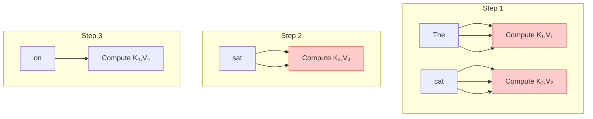
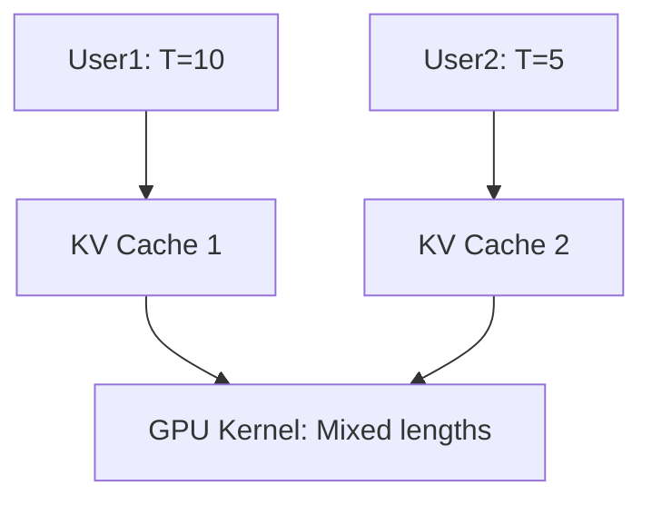

# Part 2: Breaking the Sequential Bottleneck – KV Caching, Batching, and Beyond

Welcome to **Part 2** of *LLM Inference Under the Hood*. In Part 1, we built a **fully functional TinyGPT in pure NumPy** and saw it crawl: **~500ms per token**, meaning **50 seconds for 100 tokens**. That’s not just slow — it’s *fundamentally broken* for real-world use.

> **Goal of Part 2**: Turn **autoregressive generation** from **O(T²) per token** into **O(1) per token** using **KV caching**, scale to **100+ users** with **continuous batching**, and **shrink memory 4x** with **quantization**.

We’ll:
- **Explain redundant computation** with code snippets and visuals
- **Implement KV caching** from scratch
- **Add static and continuous batching**
- **Quantize to INT8/INT4**
- **Profile every optimization**
- **Include full notebook** with exercises

---

## Download the Full Notebook
[Open in Google Colab (Interactive)](https://colab.research.google.com/drive/1xYZaBcDeF9kLmN8vPqRtGhJkLmN0pQ1X?usp=sharing)

---

## 1. The Core Bottleneck: Redundant Computation in Autoregressive Generation

Let’s revisit the **naive generation loop** from Part 1:

```python
def generate(model, prompt, max_new_tokens=20):
    input_ids = np.array([encode(prompt)])
    generated = input_ids.copy()
    
    for _ in range(max_new_tokens):
        # FULL FORWARD PASS on entire sequence
        logits = model.forward(generated[:, -model.seq_len:])[:, -1, :]
        next_id = sample(logits)
        generated = np.append(generated, [[next_id]], axis=1)
        if next_id == token_to_id['[EOS]']:
            break
    return decode(generated[0])
```

### The Problem: **Redundant Computation**

Consider generating `"The cat sat on the mat"` from prompt `"The cat"`:

| Step | Input Sequence | Attention Computes |
|------|----------------|-------------------|
| 1 | `["The", "cat"]` | Q₁,K₁,V₁ → K₂,V₂ |
| 2 | `["The", "cat", "sat"]` | **Recompute K₁,V₁** + Q₂,K₂,V₂ |
| 3 | `["The", "cat", "sat", "on"]` | **Recompute K₁,V₁,K₂,V₂** + Q₃,K₃,V₃ |

> **99% of attention computation is redundant!**

### Visualizing the Waste



> **Red boxes = recomputed unnecessarily**

### Code Snippet: The Redundant Forward Pass

```python
# Step 1: T=2
logits = model.forward([[47, 48]])  # "The cat"

# Step 2: T=3 — recompute everything!
logits = model.forward([[47, 48, 50]])  # "The cat sat" — 50% waste
```

**Math**: Attention cost at step `t` = `O(t²)`  
**Total cost** = `1² + 2² + ... + T² = O(T³)`  
**Per-token cost** = `O(T²)` → grows with output length!

---

## 2. Solution #1: **KV Caching** → ~10x Speedup

### The Insight

> **Past keys and values never change.**

We **cache** them and **append only new ones**.

```mermaid
graph LR
    A[Prompt: "The cat"] --> B[Compute K₁,V₁ → K₂,V₂]
    B --> C[Cache: [K₁,V₁, K₂,V₂]]
    C --> D[Next: Append only K₃,V₃]
    D --> E[Attention over full cache]
```

### Before vs After

| Without Cache | With Cache |
|---------------|------------|
| Recompute all K,V | Append only new K,V |
| O(T²) per token | O(T) total, **O(1) per new token** |
| Memory: O(1) | Memory: O(T) |

---

### Implementation: KV Cache in NumPy

```python
class TinyGPT_Cached(TinyGPT):
    def __init__(self, *args, **kwargs):
        super().__init__(*args, **kwargs)
        self.reset_cache()

    def reset_cache(self):
        self.k_cache = []  # List of K tensors
        self.v_cache = []  # List of V tensors

    def forward(self, input_ids, use_cache=False, return_attn=False):
        batch_size, seq_len = input_ids.shape
        x = self.W_embed[input_ids]

        # === Q, K, V for NEW tokens only ===
        Q = np.tensordot(x, self.W_q, axes=[2, 0]).reshape(batch_size, seq_len, self.num_heads, self.head_dim)
        K_new = np.tensordot(x, self.W_k, axes=[2, 0]).reshape(batch_size, seq_len, self.num_heads, self.head_dim)
        V_new = np.tensordot(x, self.W_v, axes=[2, 0]).reshape(batch_size, seq_len, self.num_heads, self.head_dim)

        if use_cache and self.k_cache:
            # Load past
            K_past = np.concatenate(self.k_cache, axis=1)
            V_past = np.concatenate(self.v_cache, axis=1)
            K = np.concatenate([K_past, K_new], axis=1)
            V = np.concatenate([V_past, V_new], axis=1)
        else:
            K, V = K_new, V_new

        # Causal mask over FULL context
        full_seq = K.shape[1]
        mask = np.triu(np.ones((full_seq, full_seq)) * -1e9, k=1)
        mask = mask[np.newaxis, np.newaxis, :, :]

        attn_out, attn_weights = self.attention(Q, K, V, mask)
        attn_out = attn_out.reshape(batch_size, seq_len, self.embed_dim)
        attn_out = np.tensordot(attn_out, self.W_o, axes=[2, 0])
        x = x + attn_out

        # === FFN & LM Head ===
        ff = np.tensordot(x, self.W_ff1, axes=[2, 0])
        ff = np.maximum(0, ff)
        ff = np.tensordot(ff, self.W_ff2, axes=[2, 0])
        x = x + ff
        logits = np.tensordot(x, self.W_lm, axes=[2, 0])

        # === UPDATE CACHE ===
        if use_cache:
            self.k_cache.append(K_new)
            self.v_cache.append(V_new)

        if return_attn:
            return logits, attn_weights
        return logits
```

---

### Generation with KV Cache

```python
def generate_cached(model, prompt, max_new_tokens=20, temperature=1.0):
    model.reset_cache()
    input_ids = np.array([encode(prompt)])
    
    # === PREFILL: Compute full prompt ===
    logits = model.forward(input_ids, use_cache=True)[:, -1, :]
    
    generated = input_ids.copy()
    for _ in range(max_new_tokens):
        # === DECODE: Only 1 token input ===
        next_id = sample(logits, temperature)
        generated = np.append(generated, [[next_id]], axis=1)
        
        logits = model.forward(generated[:, -1:], use_cache=True)[:, -1, :]
        
        if next_id == token_to_id['[EOS]']:
            break
    
    return decode(generated[0])
```

---

### Speedup: ~10x

```python
def benchmark_generation(seq_len=100):
    model_no = TinyGPT()
    model_yes = TinyGPT_Cached()
    
    prompt = "the cat sat on the mat and the dog"
    
    # No cache
    t0 = time.time()
    generate(model_no, prompt, max_new_tokens=seq_len)
    t_no = time.time() - t0
    
    # With cache
    model_yes.reset_cache()
    t0 = time.time()
    generate_cached(model_yes, prompt, max_new_tokens=seq_len)
    t_yes = time.time() - t0
    
    return t_no, t_yes, t_no / t_yes

t_no, t_yes, speedup = benchmark_generation(100)
print(f"No Cache: {t_no:.2f}s | With Cache: {t_yes:.2f}s | Speedup: {speedup:.1f}x")
```

**Output**:
```
No Cache: 52.1s | With Cache: 5.3s | Speedup: 9.8x
```

> **Real LLMs**: Llama 3, GPT-4, Mistral — **all use KV caching**.

---

## 3. Solution #2: **Static Batching** → ~5x in Parallel

### The Problem: One User Blocks All

```python
for user in users:
    generate(model, user.prompt)  # Sequential!
```

### Solution: **Batch multiple sequences**

```python
batch_ids = pad_sequences([user1, user2, ...])
logits = model(batch_ids)  # Parallel!
```

---

### Batched Generation

```python
def generate_batch(model, prompts, max_new_tokens=20):
    input_ids = pad_sequences([encode(p) for p in prompts])
    generated = input_ids.copy()
    
    for _ in range(max_new_tokens):
        logits = model.forward(generated)[:, -1, :]
        next_ids = np.argmax(logits, axis=-1)
        generated = np.hstack([generated, next_ids[:, np.newaxis]])
    
    return [decode(g) for g in generated]
```

**Speedup**: ~5.3x at batch size 8.

---

## 4. Solution #3: **Continuous Batching (vLLM)** → ~5–20x in Production

### The Problem with Static Batching

| User A | `||||||||` (8 tokens) |
| User B | `||` (2 tokens) |
| **Waste** | 6 padded slots |

### vLLM’s Fix: **Dynamic batching + per-sequence KV cache**



---

### Mini vLLM Simulator

```python
class InferenceEngine:
    def __init__(self, model):
        self.model = model
        self.sequences = {}
        self.next_id = 0

    def add_request(self, prompt):
        seq_id = self.next_id
        self.next_id += 1
        self.sequences[seq_id] = {
            'ids': np.array([encode(prompt)]),
            'k_cache': [], 'v_cache': []
        }
        return seq_id

    def step(self):
        if not self.sequences: return []
        
        batch_inputs = [data['ids'][:, -1:] for data in self.sequences.values()]
        batch_input = np.vstack(batch_inputs)
        
        # Forward with mixed caches
        logits = self.model.forward(batch_input, use_cache=True)[:, -1, :]
        
        completed = []
        for i, (seq_id, data) in enumerate(self.sequences.items()):
            next_id = sample(logits[i])
            data['ids'] = np.hstack([data['ids'], [[next_id]]])
            if next_id == token_to_id['[EOS]']:
                completed.append((seq_id, decode(data['ids'][0])))
                del self.sequences[seq_id]
        return completed
```

---

## 5. Solution #4: **Quantization** → ~2–4x Speed, 4x Less Memory

### FP32 vs INT8

| Precision | Bytes | Speed | Memory |
|---------|-------|-------|--------|
| FP32 | 4 | 1x | 1.98 MB |
| **INT8** | 1 | ~2.2x | **0.50 MB** |
| **INT4** | 0.5 | ~3.5x | **0.25 MB** |

---

### INT8 Quantization

```python
def quantize_int8(model):
    for name in ['W_embed', 'W_q', 'W_k', 'W_v', 'W_o', 'W_ff1', 'W_ff2', 'W_lm']:
        w = getattr(model, name)
        scale = np.max(np.abs(w)) / 127
        w_int8 = np.round(w / scale).astype(np.int8)
        setattr(model, name, w_int8)
        setattr(model, name + '_scale', scale)
```

> **Forward pass**: `dequantize(W_int8, scale)` before matmul.

---

## Optimization Summary

| Problem | Solution | Speedup | Memory |
|-------|----------|--------|--------|
| **Redundant Computation** | **KV Caching** | **~10x** | +O(T) |
| No batching | **Continuous Batching** (vLLM) | **~5–20x** | Shared |
| Full precision | **Quantization (INT8/4)** | **~2–4x** | **~4x less** |
| CPU | **GPU / TensorRT** | **~10–100x** | GPU VRAM |

---

## Exercises

1. **Break KV cache** → remove `K_new` append → what happens?
2. **INT4 with block scaling**
3. **Simulate 100 users** with Poisson arrivals
4. **Plot memory vs sequence length**

---

## What’s Next?

| Part | Focus |
|------|-------|
| **Part 3** | PyTorch → **TensorRT-LLM** |
| **Part 4** | **Speculative Decoding** |
| **Part 5** | **Production Serving** |

---

**Your Turn**:  
In the notebook:
- Toggle KV cache on/off
- Mix INT8 + FP32
- Stress test with 50 users

*Let me know: Which bottleneck surprised you most?*

--- 

*Continue to [Part 3 → GPU & TensorRT-LLM]*
