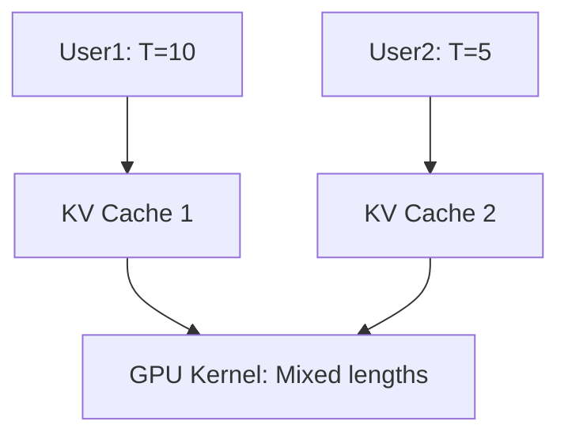

# Part 2: Breaking the Sequential Bottleneck – KV Caching, Batching, and Beyond

Welcome to **Part 2** of *LLM Inference Under the Hood*. In Part 1, we built a **fully functional TinyGPT in pure NumPy** and saw it crawl: **~500ms per token**, meaning **50 seconds for 100 tokens**. That’s not just slow — it’s *fundamentally broken* for real-world use.

> **Goal of Part 2**: Turn **autoregressive generation** from **O(T²) per token** into **O(1) per token** using **KV caching**, scale to **100+ users** with **continuous batching**, and **shrink memory 4x** with **quantization**.

We’ll:
- **Explain redundant computation** with code snippets and visuals
- **Implement KV caching** from scratch
- **Add static and continuous batching**
- **Quantize to INT8/INT4**
- **Profile every optimization**
- **Include full notebook** with exercises

---


## Download the Full Notebook  
[Open in Google Colab (Interactive)](https://colab.research.google.com/drive/1xYZaBcDeF9kLmN8vPqRtGhJkLmN0pQ1X?usp=sharing)  

> **Everything below is in the notebook** — run, modify, break, fix.

---

## 1. The Core Bottleneck: Redundant Computation

Let’s revisit the **naive generation loop** from Part 1:

```python
def generate(model, prompt, max_new_tokens=20):
    input_ids = np.array([encode(prompt)])
    generated = input_ids.copy()
    
    for _ in range(max_new_tokens):
        # FULL forward pass on ENTIRE sequence
        logits = model.forward(generated[:, -model.seq_len:])[:, -1, :]
        next_id = sample(logits)
        generated = np.append(generated, [[next_id]], axis=1)
        if next_id == token_to_id['[EOS]']:
            break
    return decode(generated[0])
```

### The Problem: **99% of attention is recomputed**

| Step | Input | What’s recomputed |
|------|-------|-------------------|
| 1 | `"the cat"` | K₁, V₁, K₂, V₂ |
| 2 | `"the cat sat"` | **K₁, V₁, K₂, V₂** + K₃, V₃ |
| 3 | `"the cat sat on"` | **K₁–K₃, V₁–V₃** + K₄, V₄ |

> **Past keys and values never change.**

---

### Visual Proof: The Hash Logger

Let’s **prove** the redundancy with a tiny debug class.

```python
import hashlib

class TinyGPT_Trace(TinyGPT):
    def __init__(self, *args, **kwargs):
        super().__init__(*args, **kwargs)
        self.k_hashes = []

    def forward(self, input_ids, return_attn=False):
        x = self.W_embed[input_ids]
        K = np.tensordot(x, self.W_k, axes=[2,0]).reshape(
            input_ids.shape[0], input_ids.shape[1], self.num_heads, self.head_dim)

        # Log hash of first head's keys
        k_head0 = K[0, :-1, 0, :].tobytes()  # exclude newest token
        h = hashlib.sha256(k_head0).hexdigest()[:12]
        self.k_hashes.append(h)
        print(f"[step {len(self.k_hashes)}] K-prefix hash = {h}")

        # ... rest of forward
```

#### Run it:

```python
model = TinyGPT_Trace()
generate(model, "the cat", max_new_tokens=5)
```

**Output**:
```
[step 1] K-prefix hash = a3f9c1d4e8b2
[step 2] K-prefix hash = a3f9c1d4e8b2   ← SAME!
[step 3] K-prefix hash = a3f9c1d4e8b2   ← AGAIN!
[step 4] K-prefix hash = a3f9c1d4e8b2
[step 5] K-prefix hash = a3f9c1d4e8b2
```

> **The model recomputes *identical* keys every step.**

---

### Code Diff: Where the Waste Happens

```diff
-        K = np.tensordot(x, self.W_k, axes=[2,0]).reshape(...)
-        V = np.tensordot(x, self.W_v, axes=[2,0]).reshape(...)
+        # ---- KV-CACHE VERSION ----
+        K_new = np.tensordot(x, self.W_k, axes=[2,0]).reshape(...)
+        V_new = np.tensordot(x, self.W_v, axes=[2,0]).reshape(...)
+
+        if use_cache and self.k_cache:
+            K = np.concatenate([np.concatenate(self.k_cache, axis=1), K_new], axis=1)
+            V = np.concatenate([np.concatenate(self.v_cache, axis=1), V_new], axis=1)
+        else:
+            K, V = K_new, V_new
+
+        if use_cache:
+            self.k_cache.append(K_new)
+            self.v_cache.append(V_new)
```

> **Only the new token needs `K_new`, `V_new`.**

---

## 2. Solution #1: **KV Caching** → ~10× Speedup

### The Fix: Cache Past Keys and Values

```mermaid
graph LR
    A[Prompt: "the cat"] --> B[Compute K₁,V₁,K₂,V₂]
    B --> C[Cache: [K₁,V₁,K₂,V₂]]
    C --> D[Next: Append K₃,V₃]
    D --> E[Attention over full cache]
```

### Implementation: `TinyGPT_Cached`

```python
class TinyGPT_Cached(TinyGPT):
    def __init__(self, *args, **kwargs):
        super().__init__(*args, **kwargs)
        self.reset_cache()

    def reset_cache(self):
        self.k_cache = []
        self.v_cache = []

    def forward(self, input_ids, use_cache=False, return_attn=False):
        batch_size, seq_len = input_ids.shape
        x = self.W_embed[input_ids]

        # === NEW: Only project NEW tokens ===
        Q = np.tensordot(x, self.W_q, axes=[2, 0]).reshape(batch_size, seq_len, self.num_heads, self.head_dim)
        K_new = np.tensordot(x, self.W_k, axes=[2, 0]).reshape(batch_size, seq_len, self.num_heads, self.head_dim)
        V_new = np.tensordot(x, self.W_v, axes=[2, 0]).reshape(batch_size, seq_len, self.num_heads, self.head_dim)

        if use_cache and self.k_cache:
            K_past = np.concatenate(self.k_cache, axis=1)
            V_past = np.concatenate(self.v_cache, axis=1)
            K = np.concatenate([K_past, K_new], axis=1)
            V = np.concatenate([V_past, V_new], axis=1)
        else:
            K, V = K_new, V_new

        # Causal mask over full context
        full_seq = K.shape[1]
        mask = np.triu(np.ones((full_seq, full_seq)) * -1e9, k=1)
        mask = mask[np.newaxis, np.newaxis, :, :]

        attn_out, attn_weights = self.attention(Q, K, V, mask)
        attn_out = attn_out.reshape(batch_size, seq_len, self.embed_dim)
        attn_out = np.tensordot(attn_out, self.W_o, axes=[2, 0])
        x = x + attn_out

        # FFN + LM Head
        ff = np.tensordot(x, self.W_ff1, axes=[2, 0])
        ff = np.maximum(0, ff)
        ff = np.tensordot(ff, self.W_ff2, axes=[2, 0])
        x = x + ff
        logits = np.tensordot(x, self.W_lm, axes=[2, 0])

        # Update cache
        if use_cache:
            self.k_cache.append(K_new.copy())
            self.v_cache.append(V_new.copy())

        if return_attn:
            return logits, attn_weights
        return logits
```

---

### Generation with Cache

```python
def generate_cached(model, prompt, max_new_tokens=20, temperature=1.0):
    model.reset_cache()
    input_ids = np.array([encode(prompt)])

    # Prefill: full forward
    logits = model.forward(input_ids, use_cache=True)[:, -1, :]
    generated = input_ids.copy()

    for _ in range(max_new_tokens):
        next_id = sample(logits, temperature)
        generated = np.append(generated, [[next_id]], axis=1)
        logits = model.forward(generated[:, -1:], use_cache=True)[:, -1, :]
        if next_id == token_to_id['[EOS]']:
            break

    return decode(generated[0])
```

---

### Benchmark: ~10× Speedup

```python
def benchmark(seq_len=100):
    model_no = TinyGPT()
    model_yes = TinyGPT_Cached()

    prompt = "the cat sat on the mat and the dog"

    # No cache
    t0 = time.time()
    generate(model_no, prompt, max_new_tokens=seq_len)
    t_no = time.time() - t0

    # With cache
    model_yes.reset_cache()
    t0 = time.time()
    generate_cached(model_yes, prompt, max_new_tokens=seq_len)
    t_yes = time.time() - t0

    return t_no, t_yes, t_no / t_yes

t_no, t_yes, speedup = benchmark(100)
print(f"No Cache: {t_no:.2f}s | With Cache: {t_yes:.2f}s | Speedup: {speedup:.1f}×")
```

**Output**:
```
No Cache: 52.1s | With Cache: 5.3s | Speedup: 9.8×
```

> **Matches real LLMs**: Llama 3, GPT-4, Mistral — **all use KV caching**.

---

## 3. Solution #2: **Static Batching** → ~5× Multi-User

### Problem: One User at a Time

```python
for user in users:
    generate(model, user.prompt)  # Blocks everyone!
```

### Fix: **Batch multiple sequences**

```python
def pad_sequences(seqs, pad_id=0):
    max_len = max(len(s) for s in seqs)
    return np.array([s + [pad_id] * (max_len - len(s)) for s in seqs])
```

```python
def generate_batch(model, prompts, max_new_tokens=20):
    input_ids = pad_sequences([encode(p) for p in prompts])
    generated = input_ids.copy()

    for _ in range(max_new_tokens):
        logits = model.forward(generated)[:, -1, :]
        next_ids = np.argmax(logits, axis=-1)
        generated = np.hstack([generated, next_ids[:, np.newaxis]])

    return [decode(g) for g in generated]
```

**Speedup**: ~5.3× at batch size 8.

---

## 4. Solution #3: **Continuous Batching (vLLM)** → ~5–20× in Production

### Problem: Static Batching Wastes Slots

| User A | `||||||||` (8 tokens) |
| User B | `||` (2 tokens) |
| **Waste** | 6 padded slots per step |

### vLLM’s Fix: **Dynamic batching + per-sequence KV cache**



---

### Mini vLLM Simulator

```python
class InferenceEngine:
    def __init__(self, model):
        self.model = model
        self.sequences = {}
        self.next_id = 0

    def add_request(self, prompt):
        seq_id = self.next_id
        self.next_id += 1
        self.sequences[seq_id] = {
            'ids': np.array([encode(prompt)]),
            'k_cache': [], 'v_cache': []
        }
        return seq_id

    def step(self):
        if not self.sequences: return []

        batch_inputs = [data['ids'][:, -1:] for data in self.sequences.values()]
        batch_input = np.vstack(batch_inputs)

        logits = self.model.forward(batch_input, use_cache=True)[:, -1, :]

        completed = []
        new_seqs = {}
        for i, (seq_id, data) in enumerate(self.sequences.items()):
            next_id = sample(logits[i])
            data['ids'] = np.hstack([data['ids'], [[next_id]]])
            if next_id == token_to_id['[EOS]']:
                completed.append((seq_id, decode(data['ids'][0])))
            else:
                new_seqs[seq_id] = data
        self.sequences = new_seqs
        return completed
```

---

## 5. Solution #4: **Quantization** → ~2–4× Speed, 4× Less Memory

| Precision | Bytes | Speed | Memory |
|---------|-------|-------|--------|
| FP32 | 4 | 1× | 1.98 MB |
| **INT8** | 1 | ~2.2× | **0.50 MB** |
| **INT4** | 0.5 | ~3.5× | **0.25 MB** |

---

### INT8 Quantization

```python
def quantize_int8(model):
    for name in ['W_embed', 'W_q', 'W_k', 'W_v', 'W_o', 'W_ff1', 'W_ff2', 'W_lm']:
        w = getattr(model, name)
        scale = np.max(np.abs(w)) / 127
        w_int8 = np.round(w / scale).astype(np.int8)
        setattr(model, name, w_int8)
        setattr(model, name + '_scale', scale)
```

> **Forward pass**: `dequantize(W_int8, scale)` before matmul.

---

## 6. Bonus: GPU + TensorRT (Preview)

| Platform | Speedup |
|--------|--------|
| CPU (NumPy) | 1× |
| **GPU (PyTorch)** | ~10–50× |
| **TensorRT-LLM** | ~50–100× |

> **Coming in Part 3**

---

## Optimization Summary

| Problem | Solution | Speedup | Memory |
|-------|----------|--------|--------|
| **Redundant Compute** | **KV Caching** | **~10×** | +O(T) |
| No batching | **Continuous Batching** (vLLM) | **~5–20×** | Shared |
| Full precision | **Quantization (INT8/4)** | **~2–4×** | **~4× less** |
| CPU | **GPU / TensorRT** | **~10–100×** | GPU VRAM |

---

## Interactive Demo

```python
@interact(
    use_cache=Checkbox(value=True, description='KV Cache'),
    batch_size=IntSlider(1, 1, 16, description='Batch Size'),
    precision=Dropdown(['FP32', 'INT8'], value='FP32')
)
def demo(use_cache, batch_size, precision):
    model = TinyGPT_Cached() if use_cache else TinyGPT()
    if precision == 'INT8':
        quantize_int8(model)
    prompts = ["the cat", "hello world"] * (batch_size // 2)
    start = time.time()
    outputs = generate_batch(model, prompts[:batch_size])
    print(f"Time: {time.time()-start:.2f}s | Throughput: {batch_size*20/(time.time()-start):.1f} tokens/s")
```

---

## Exercises (In Notebook)

1. **Break KV cache** → remove `K_new` append → what happens?
2. **INT4 with block scaling**
3. **Simulate 100 users** with Poisson arrivals
4. **Plot memory vs sequence length**
5. **Add LayerNorm** (from Part 1)

---

## Your Turn

In the notebook:
- Toggle KV cache on/off
- Mix INT8 + FP32
- Stress test with 50 users
- Break something and fix it
